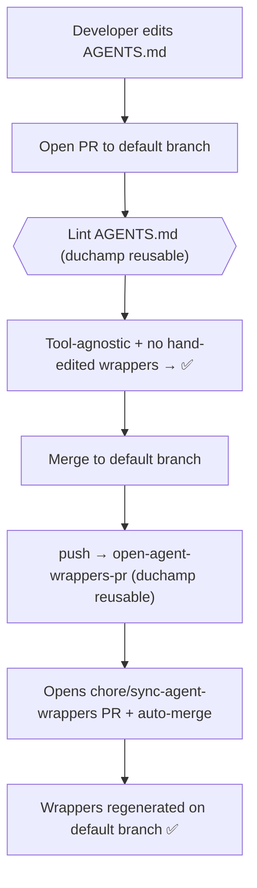

# Adopting the AGENTS.md tooling in a repo

This repo (`artsy/duchamp`) hosts reusable GitHub Actions that let any Artsy repo
maintain a single **`AGENTS.md`** as the source of truth for AI coding-agent
guidance, and automatically generate the tool-specific wrapper files
(`.cursorrules`, `.github/copilot-instructions.md`) from it.

This guide walks through adopting it in a new repo. Reference implementations:
`artsy/agent-tooling`, `artsy/force`, `artsy/volt`.

## What you get

- **Lint** — on every PR that touches `AGENTS.md` or the wrappers:
  - rejects Claude-specific patterns in `AGENTS.md` (they belong in `CLAUDE.md`), and
  - rejects hand-edits to the generated wrapper files.
- **Auto-sync** — after an `AGENTS.md` change merges to the default branch, the
  wrappers are regenerated and an **auto-merging PR** is opened with the result.



## Prerequisites

1. **An `AGENTS.md` at the repo root**, written tool-agnostically. Keep
   Claude-specific content (skills, hooks, MCP tool names, `/plugin` commands,
   `CLAUDE_PLUGIN_ROOT`, `PreToolUse`, etc.) out of it — put that in `CLAUDE.md`.
   The lint step enforces this. A good pattern is to make `CLAUDE.md` a thin file
   that imports `AGENTS.md`:

   ```md
   <!-- CLAUDE.md -->
   # <Repo> Development Guidelines

   See @AGENTS.md for shared development guidance.

   The following is Claude Code-specific and augments `AGENTS.md`:
   - ...
   ```

2. **A `CONVENTIONS_SYNC_TOKEN` secret** on the repo — a fine-grained PAT (or
   GitHub App token) with **Contents: Read and write** and **Pull requests: Read
   and write** on this repo.

3. **"Allow auto-merge" enabled** in the repo's Settings → General, so the sync
   PR can merge itself once checks pass.

## Steps

### 1. Add the lint workflow

Create `.github/workflows/lint-agents-md.yml`:

```yaml
name: Lint AGENTS.md (via artsy/duchamp)

on:
  pull_request:
    paths:
      - AGENTS.md
      - .cursorrules
      - .github/copilot-instructions.md

jobs:
  lint:
    uses: artsy/duchamp/.github/workflows/lint-agents-md.yml@main
```

### 2. Add the auto-sync workflow

Create `.github/workflows/sync-agent-wrappers.yml`:

```yaml
name: Sync agent wrappers

on:
  push:
    branches: [main]        # your default branch
    paths:
      - AGENTS.md

jobs:
  sync:
    uses: artsy/duchamp/.github/workflows/open-agent-wrappers-pr.yml@main
    secrets:
      sync-token: ${{ secrets.CONVENTIONS_SYNC_TOKEN }}
```

> If your default branch isn't `main`, update `branches:` accordingly.

### 3. Merge, and let the wrappers bootstrap themselves

Open a PR with the two workflow files (and your `AGENTS.md` if it's new). Once it
merges to the default branch, the sync workflow runs and opens a
`chore: sync agent wrappers from AGENTS.md` PR that creates `.cursorrules` and
`.github/copilot-instructions.md`. That PR auto-merges when its checks pass.

You do **not** need to commit the wrapper files by hand — and you shouldn't; the
lint guard rejects hand-edits to them.
